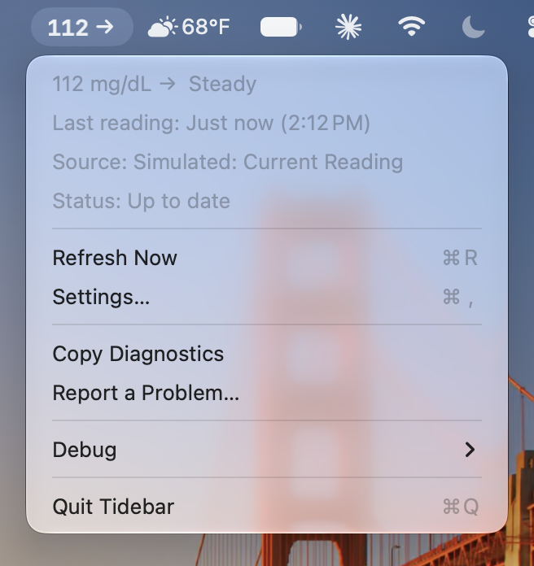
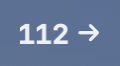
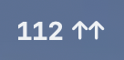
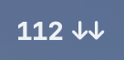
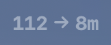
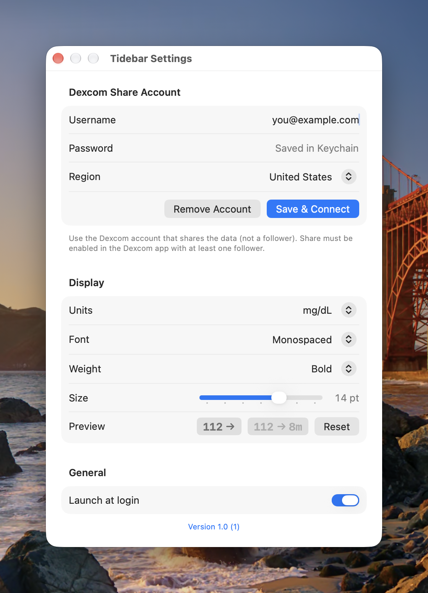
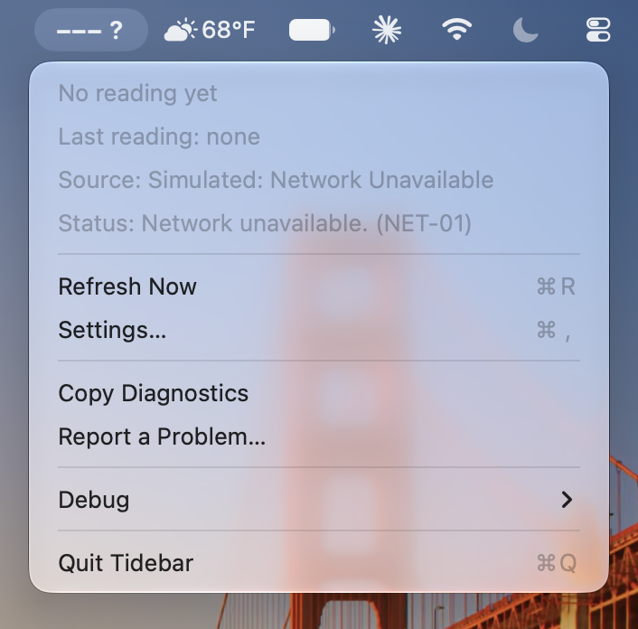

<p align="center">
  
</p>

<h1 align="center">Tidebar</h1>

<p align="center">
  A lightweight macOS menu bar app that shows your current Dexcom glucose value and trend, e.g. <code>112 →</code>.
</p>

<p align="center">
  <a href="https://github.com/JustinFay01/Tidebar/releases/latest"></a>
  <a href="#requirements"></a>
  <a href="#requirements"></a>
</p>

> [!WARNING]
> Tidebar is an independent project and is **not affiliated with, endorsed by, or supported by Dexcom**.
> It uses an unofficial, undocumented API that can change or stop working at any time.
> It is **not a medical device**. Do not use it to make treatment decisions. Always confirm with your
> Dexcom receiver or app.

<p align="center">
  
</p>

## Features

- Current glucose and trend arrow in the menu bar. Values 6–12 minutes old are dimmed and show their age (`112 → 8m`).
- `--- ?` when data is missing, stale (older than 12 minutes), or can't be fetched, so an old value is never shown as current.
- mg/dL or mmol/L, formatted for your locale.
- Configurable menu bar font, weight, and size.
- Polls on the sensor's 5-minute cadence, and refreshes after the Mac wakes from sleep or the network comes back.
- Lives only in the menu bar: no Dock icon or windows besides Settings. Optional launch at login.

| Menu bar | Meaning |
|---|---|
|  | Current reading, steady |
|  | Rising quickly |
|  | Falling quickly |
|  | Reading is 6–12 minutes old: dimmed, with its age |
|  | Missing, stale, or can't be fetched |

## Requirements

- macOS 14 Sonoma or later.
- A Dexcom CGM with **Share** turned on in the Dexcom app and **at least one follower**. Tidebar was built for the G7.
- The Dexcom account that *shares* the data (not a follower's account).

## Installation

**Homebrew:**

```sh
brew install --cask justinfay01/tap/tidebar
```

**Direct download:** get `Tidebar-<version>.zip` from the [latest release](https://github.com/JustinFay01/Tidebar/releases/latest),
unzip it, and move `Tidebar.app` to `/Applications`. Releases are signed with a Developer ID and notarized by Apple.

**Build from source:**

```sh
git clone https://github.com/JustinFay01/Tidebar.git
cd Tidebar
xcodebuild build -scheme Tidebar -configuration Release
```

Or open `Tidebar.xcodeproj` in Xcode and run the `Tidebar` scheme.

## Setup

1. Open Tidebar's menu in the menu bar and choose **Settings…**
2. Enter your Dexcom username and password, choose your region (United States, Outside United States, or Japan), and click **Save & Connect**.

<p align="center">
  
</p>

## Troubleshooting

When something is wrong, the menu bar shows `--- ?` and the menu's **Status** line explains why,
followed by a code:

<p align="center">
  
</p>

| Code | Meaning | What to try |
|---|---|---|
| `AUTH-01` | Dexcom rejected the sign-in | Check the username, password, and **region** in Settings. Use the account that shares the data, not a follower's. Tidebar stops trying until you save Settings again. |
| `AUTH-02` | Too many sign-in attempts | Dexcom has temporarily locked or rate-limited the account. Tidebar backs off and retries later; wait before trying again. |
| `NET-01` | Couldn't reach Dexcom | Check your internet connection. This often shows briefly after the Mac wakes up. |
| `DATA-01` | Signed in, but no readings | In the Dexcom app, make sure **Share** is on and you have at least one follower. |
| `DATA-02` | Latest reading is over 12 minutes old | Check that your phone has signal and the Dexcom app is uploading. |
| `SRV-01` | Unexpected response from Dexcom | Usually temporary. If it persists, Dexcom may have changed the API; please report it. |
| `SETUP-01` / `SETUP-02` | No account or password saved | Open **Settings…** and enter your Dexcom account. |
| `SETUP-03` | Keychain wouldn't return the saved password | Quit and reopen Tidebar. If it persists, re-enter the password in **Settings…**; ad-hoc signed builds can't use the Keychain. |

### Reporting a problem

Choose **Report a Problem…** in Tidebar's menu. It copies a diagnostics report to your clipboard and
opens a new GitHub issue. Paste the report into the **Diagnostics** field and review it before submitting.
**Copy Diagnostics** copies the report without opening GitHub.

The report contains your Tidebar and macOS versions, your region, unit, and launch-at-login settings,
the current status, and the last 200 connection events (request names, HTTP status codes, Dexcom error
codes, and timings). It **never** contains your username, password, account or session IDs, glucose
values, or reading times. Tidebar never sends it anywhere; you choose whether to post it.

The same events are written to the macOS system log:

```sh
log show --last 1h --predicate 'subsystem == "com.jnfcorp.Tidebar"'
```

## Privacy

- Your password is stored in the macOS Keychain. Your username and preferences are stored in UserDefaults.
- Glucose readings are kept in memory only and are never written to disk.
- Recent connection activity for diagnostics is kept in memory and also written to the macOS system log on your Mac. It never includes credentials or glucose data, and leaves your Mac only if you paste it somewhere.
- Tidebar talks only to Dexcom's Share servers for your region. It has no analytics or tracking.
- The app is sandboxed with only outgoing network access.

## How it works

Tidebar uses the Dexcom **Share** API, the same unofficial service that the Dexcom Follow app and
community projects such as Nightscout use:

1. `General/AuthenticatePublisherAccount` exchanges the username and password for an account ID.
2. `General/LoginPublisherAccountById` exchanges the account ID and password for a session ID.
3. `Publisher/ReadPublisherLatestGlucoseValues` returns recent readings for the session.

The session is reused until Dexcom expires it, and then Tidebar signs in again once. To avoid triggering
Dexcom's account lockout, a rejected password stops all sign-in attempts until you update Settings,
and other sign-in failures back off for up to 15 minutes.

### References

The endpoints, region URLs, application IDs, and error codes come from these projects:

- [pydexcom](https://github.com/gagebenne/pydexcom) by Gage Benne (MIT): a Python client for the Share API,
  and the primary reference for Tidebar's implementation. See
  [`const.py`](https://github.com/gagebenne/pydexcom/blob/main/pydexcom/const.py) and
  [`dexcom.py`](https://github.com/gagebenne/pydexcom/blob/main/pydexcom/dexcom.py), or the
  [documentation](https://gagebenne.github.io/pydexcom/).
- [share2nightscout-bridge](https://github.com/nightscout/share2nightscout-bridge): Nightscout's bridge
  from Dexcom Share, one of the original implementations of this protocol.
- [What is Dexcom Follow?](https://www.dexcom.com/faqs/what-is-dexcom-follow): Dexcom's own explanation of Share and Follow.

## Development

Building requires **Xcode 27** or later. To get set up, run:

```sh
scripts/setup.sh
```

The setup script:
- checks your macOS, Xcode, and swift-format setup
- installs a pre-commit hook that lints staged Swift files
- runs the same lint, Release build, and unit tests as CI

Pass `--help` to see its options.

| Command | What it does |
|---|---|
| `scripts/lint.sh` | Lint with swift-format, using the rules in `.swift-format` |
| `scripts/lint.sh --fix` | Auto-format, then lint |
| `scripts/test.sh` | Run the unit tests |
| `scripts/build.sh [Debug\|Release]` | Build the app |
| `scripts/install-local.sh` | Build Release, install it in `/Applications`, and launch it (quits any running copy) |

The scripts sign builds ad hoc, so you don't need an Apple developer account. In Xcode, if you get a
signing error, choose your own team (or "Sign to Run Locally") under the Tidebar target's
**Signing & Capabilities**, and don't commit that change.

### Continuous integration

Every pull request runs **Lint** and **Build & Test** on GitHub Actions
(`.github/workflows/ci.yml`), using the same scripts as above, so a green local run should mean green CI.

The code is split into layers so other data sources (e.g. Nightscout) can be added without touching the UI or polling:

| Folder | Contents |
|---|---|
| `Tidebar/Domain` | Provider-agnostic models: `GlucoseReading`, `TrendDirection`, `GlucoseUnit` |
| `Tidebar/Providers` | The `GlucoseProvider` protocol, configuration and factory, and the Dexcom Share provider |
| `Tidebar/Monitoring` | Polling schedule, staleness rules, and display formatting |
| `Tidebar/Persistence` | Keychain, settings keys, launch at login |
| `Tidebar/Views` | Menu bar label, dropdown menu, Settings |
| `Tidebar/Debug` | Debug-build-only error and reading simulation |

### Releasing

Releases are signed with a Developer ID, notarized, and published from the maintainer's Mac using the
scripts in [`release/`](release/). See [release/README.md](release/README.md) for the runbook.

### Debug menu

Debug builds add a **Debug** submenu to the dropdown that replaces the real provider with a simulated one.
It can simulate each error (invalid credentials, network unavailable, no readings, account locked, server
error) and reading states (current, aging, stale, rising or falling quickly, no trend) without contacting
Dexcom. Choose **Live Data** to go back. The simulation code is compiled out of Release builds.

## License

Tidebar is released under the [MIT License](LICENSE).
